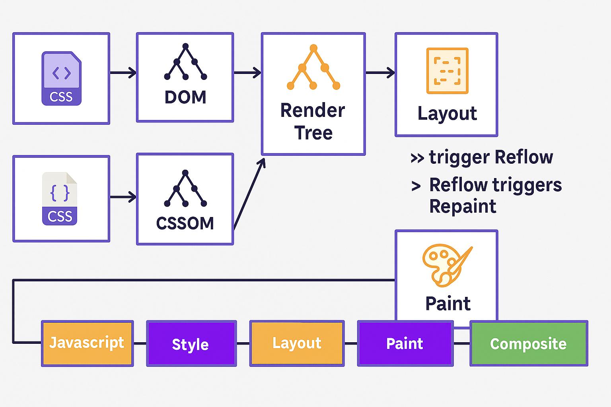
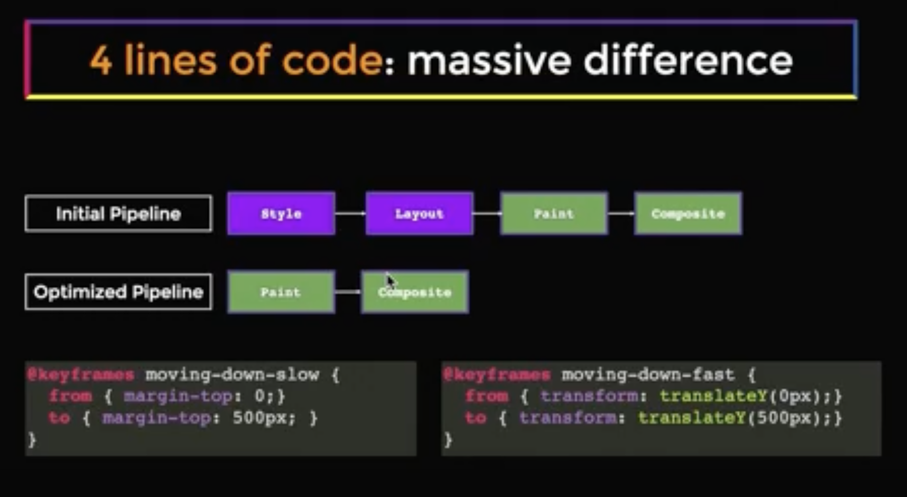

## 🌐 Browser Reflow – The Hidden Cost of "Just a Little CSS"

In frontend system design, it's not just *what* you build, but *how it renders*. And deep in the rendering pipeline lies a silent performance killer: **Reflow**.

---

### 🔄 What’s a Reflow?

Every time you change layout-affecting styles (like width, height, font-size, padding...), the browser re-calculates the positions and sizes of affected elements.

> That’s a **reflow** — like rearranging chairs at a dinner party every time someone changes seats. 🪑

---

### 🛠️ The Rendering Pipeline

Here’s how browsers paint pixels on screen:

1. **JavaScript** – You tweak the DOM.
2. **Style Calculation** – CSS is applied.
3. **Layout (Reflow)** – Browser figures out who goes where.
4. **Paint** – Fills in pixels (colors, borders, text...).
5. **Composite** – Layers stitched together (hello, GPU!).

> ⚠️ Changes to layout → trigger **Reflow**.  
> Reflow → often triggers **Repaint**.  
> Repaint → can trigger **Composite**.

---

### 🔥 CPU vs GPU – Who Does What?

| Stage        | Handled by | Notes |
|--------------|------------|-------|
| JavaScript   | 🧠 CPU     | Logic, DOM updates |
| Style/Layout | 🧠 CPU     | Heavy lifting in calculating positions |
| Paint        | 🎨 CPU     | Draws text, colors, shadows |
| Composite    | 🚀 GPU     | Moves layers, animates transforms |

---

### 💣 What *Triggers* Reflow?

- Changing element size, position, display, or font
- Modifying DOM structure (add/remove elements)
- Reading layout properties like `offsetHeight` or `getBoundingClientRect()` forces **sync layout** 🤕
- Animating properties like `top`, `left`, `height` (use `transform` instead!)

> TL;DR: The more you reflow, the more your CPU sweats. 💦

---

### 🧠 System Design Tips for Frontend Pros

- Batch DOM reads/writes to avoid layout thrashing
- Prefer `transform` & `opacity` for GPU-powered animations
- Debounce expensive layout changes
- Virtualize long lists to skip unnecessary layout work

In above exaple the margin property kicks in the style and layout stage because the browser needs to calculate where to position each element.
But in case of `transform`, the browser can offload it to the GPU, avoiding a reflow. css transform does not utilize gpu its just a pixel change
---

📌 **Golden Rule**:
> If it moves the DOM, it costs the CPU.  
> If you can `transform` it — you're offloading to GPU = smoother UX.

---

🧪 Bonus Debug Tip:
Open DevTools → Performance tab → record → look for **Layout**, **Paint**, and **Composite** timings. You’ll see where your app is sweating.

